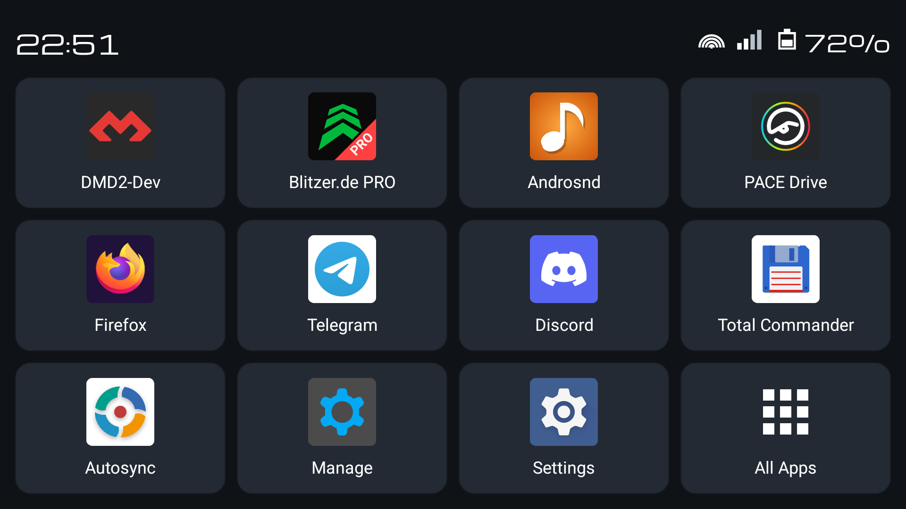
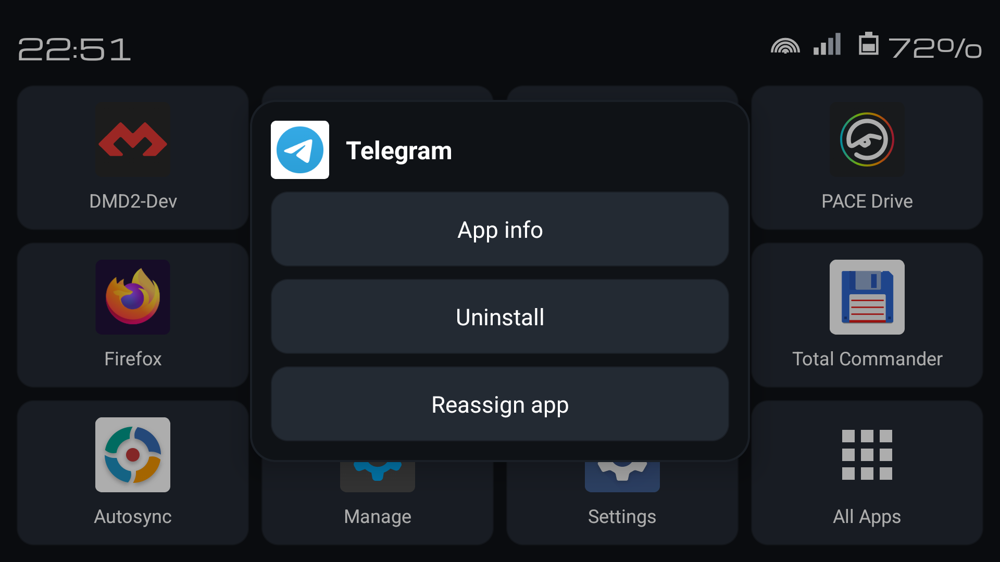
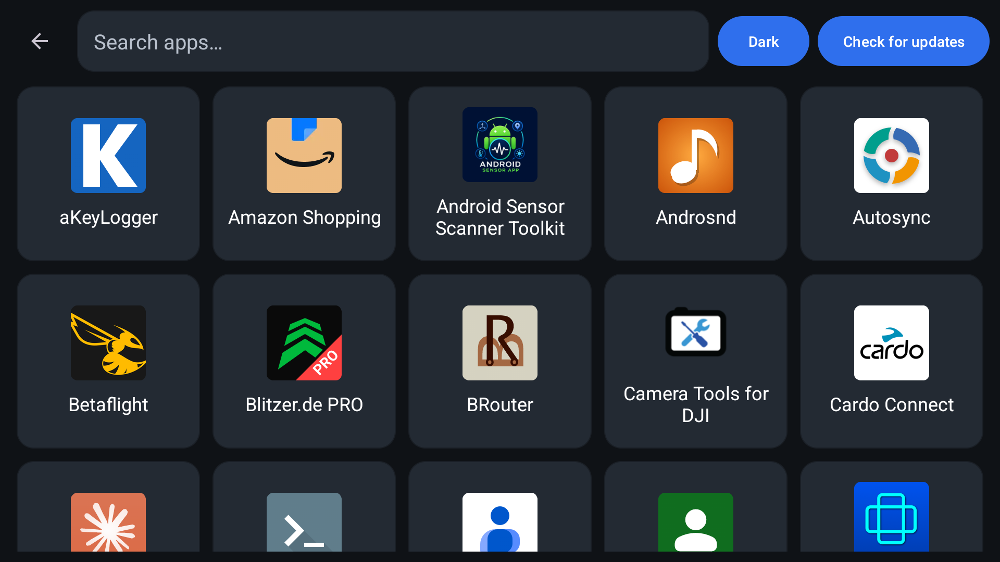
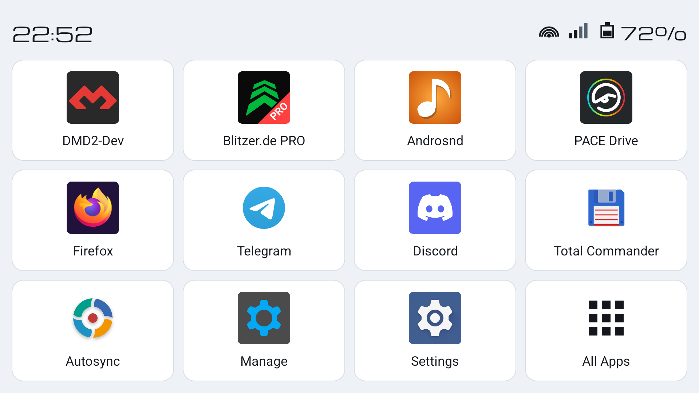

# motoLauncher

A clean home screen for Android-based motorcycle navigation devices, designed
for quick access while riding with gloves and a handlebar remote.

## Overview

motoLauncher replaces the standard home screen with a simpler, more practical
launcher experience for life on the bike. It focuses on large app tiles, clear
information, and fast access to the apps you use most.

## Highlights

- **Favourite apps front and centre.** Keep your most important apps on the
  home screen for immediate access.
- **Full app list.** Browse all installed apps in one place and use search to
  find what you need quickly.
- **Simple customisation.** Change, clear, or reassign favourite slots directly
  from the launcher.
- **Made for riding.** The interface is designed for glove use and works well
  with a handlebar remote.
- **On-demand updates.** Check for new versions when convenient and install them
  directly from the launcher.
- **At-a-glance status.** See the time, Wi-Fi, cellular, and battery
  information on the home screen.

## Everyday use

Tap any favourite on the home screen to open it immediately. The dedicated
**All Apps** tile opens the full app library, where you can browse, search, and
launch any installed app. If you want to change your setup, favourite slots can
be updated in place without leaving the launcher experience.

## Screenshots

### Home

### Home action menu

### All apps

### Light theme

